# Patching circuits against connectivity networks (Qwen3.5-2B and 4B)

Do two very different ways of finding functional units in a language model find the same neurons? **Attribution patching** finds, for each task, the neurons that most drive the model's correct answer (a *circuit*). **Connectivity parcellation** (this project's pipeline) groups all MLP neurons into *networks* by how they co-activate on ordinary text, with no tasks involved. This page summarises every analysis comparing the two, from LOG.md Iterations 30-35 (2026-09-23 to 2026-10-01). Results for four further 4B single-dataset network sets (bookcorpus, agnews, tldr17, codeparrot) and for the coarse pooled 2B networks were still running when this page was written.

## In short

- **The circuits are not the networks.** A task circuit (the top 0.1% of neurons, 147 at 2B and 294 at 4B) spreads over about 45 of the 100 networks, against about 50-56 for random neurons from the same layers: a real but small concentration. No circuit is "a network".
- **But the networks carry the circuits' organisation.** Tasks whose circuits share neurons also put their *other* neurons into the same networks (Spearman 0.26-0.70 on the real networks against 0.08-0.24 on the null partition, in all eight network sets). Same-domain tasks sit closer together in network space. A new task's circuit puts about a quarter of its neurons into the five networks its sibling tasks use most, 2.6-2.8x chance for Language, Formal and Physical tasks, against about 1.5x for a partition that keeps only neuron-level properties.
- **Language and Formal are the clearest domains; Social is the weakest everywhere**, already on the patching side: its tasks barely share circuit neurons with each other.
- **The fine networks (k = 100) carry the signal**: coarser parcellations (k = 10, 20) lose most of it, except on bookcorpus.
- Effect sizes are moderate, not large: the overlap is systematic but partial.

## 1. Setup

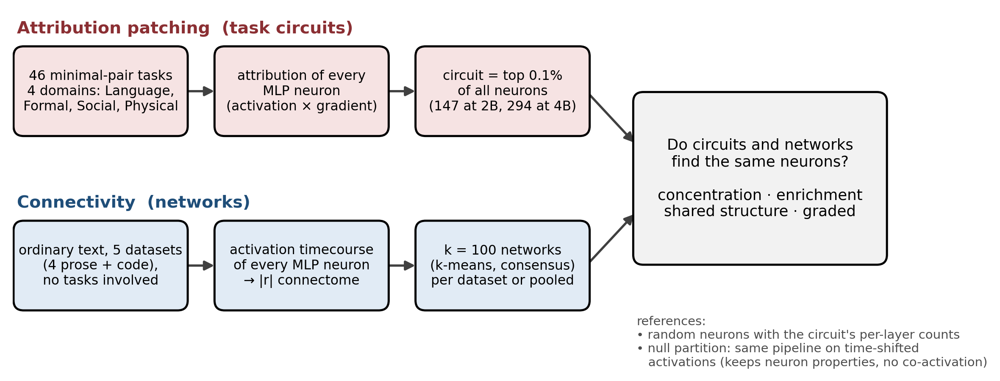

**Models.** Qwen3.5-2B (24 layers x 6,144 MLP neurons = 147,456) and Qwen3.5-4B (32 x 9,216 = 294,912). Every MLP neuron is used on both sides.

**Patching side.** The 46 minimal-pair tasks of LLM_Modularity (Pengrui Han et al.), in four domains: Language (`Lan`), Formal reasoning (`MD`), Social reasoning / theory of mind (`ToM`) and Physical reasoning (`phys`). Reimplemented in plain PyTorch (`parcelmate/patching.py`), float32, no thinking mode, with the original's token-alignment filter. A task is kept only if the model is "both-correct" (prefers the right answer on the clean prompt and flips on the corrupted one) on at least 60% of items, with at least 300 items. That leaves 27 tasks at 2B (Language 7, Formal 10, Social 5, Physical 5) and 38 at 4B (7, 16, 6, 9). Each kept task gets an attribution score per neuron (activation x gradient of the logit difference). Its **circuit** is the top 0.1% of all neurons by positive attribution, selected exactly as the original code does; 1% is the robustness check.

**Connectivity side.** Each neuron's activation timecourse over ordinary text, the |r| connectome between all neurons, then the pipeline confirmed on GPT-2: Fisher-transformed standardized profiles sparsified to their top 10%, PCA-100, k-means with 200 restarts and a Hungarian consensus, **k = 100 networks**, fitted on two independent halves of the data. Network sets compared (x axes below):

| label | fitted on | model |
|---|---|---|
| book, wiki, news, tldr, code | one dataset: bookcorpus, wikitext, agnews, tldr17, codeparrot (Python) | 2B |
| pool | all five datasets together (equal weight; 2 x 40,960 tokens each) | 2B |
| wiki, pool | wikitext; all five together | 4B |

Pooling is used here, unlike in the rest of the project, because the circuits come from an independent localiser, so there is no double dipping.

**Network quality** (split-half, against the null partition; the 2B agnews, tldr17 and codeparrot scores are still running): reliability (ARI between the halves' partitions) 0.58-0.72 against 0.01-0.03 (2B wikitext 0.61, bookcorpus 0.72, pool 0.59; 4B wikitext 0.58, pool 0.59); held-out fidelity (block-mean prediction of the other half's |r|) r = 0.38-0.42 against 0.16-0.21. The pooled networks are as reliable as the wikitext ones and less than bookcorpus's, and as faithful as either.

**Two references, used throughout.**

1. **Layer-matched random neurons.** Random sets with the circuit's exact number of neurons in every layer. Both methods favour certain layers and our networks are partly layer-local, so without this match a circuit would look concentrated merely for sitting in a few layers (the test suite plants exactly this case).
2. **The null partition.** The same pipeline run on activations with each neuron's timecourse circularly shifted: every neuron keeps its own statistics (mean, variance, autocorrelation, how often it is active), but co-activation between neurons is destroyed. Whatever the real networks show beyond the null partition is due to co-activation structure, not to properties of individual neurons.

All values below are means over the two halves unless stated; 0.1% circuits unless stated.

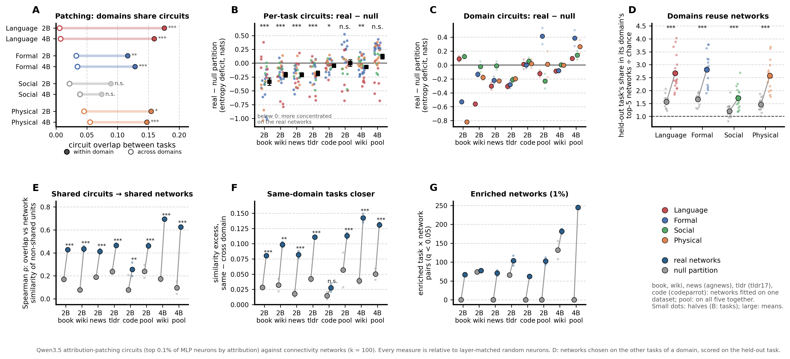

## 2. The patching domains are coherent (panel A)

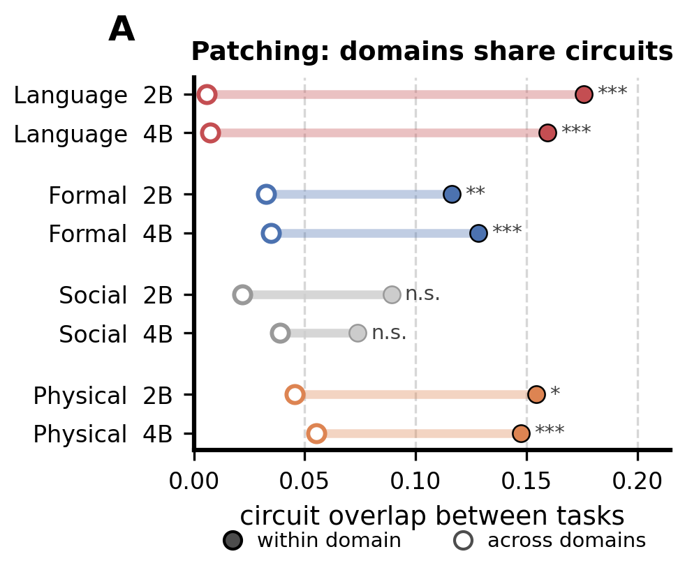

**Question.** Before asking whether circuits match networks, do the four task domains mean anything on the patching side alone? **Method.** The original's overlap ratio between two tasks' circuits (share of task i's circuit neurons also in task j's), averaged over same-domain pairs (filled dot) and cross-domain pairs (open dot); one-sided permutation test over task-domain labels (10,000). **Result.** Language, Formal and Physical tasks share far more circuit neurons within their domain than across, in both models: Language 0.176 against 0.006 at 2B (p = 0.0003) and 0.159 against 0.007 at 4B; Formal 0.116 against 0.033 and 0.128 against 0.035; Physical 0.154 against 0.046 and 0.148 against 0.055 (all p <= 0.02). **Social is not significant** (2B 0.089 against 0.022, p = 0.055; 4B p = 0.11): its tasks have the least common circuitry, which caps what any network comparison can find for it.

## 3. Are circuits concentrated in the networks? (panels B, C)

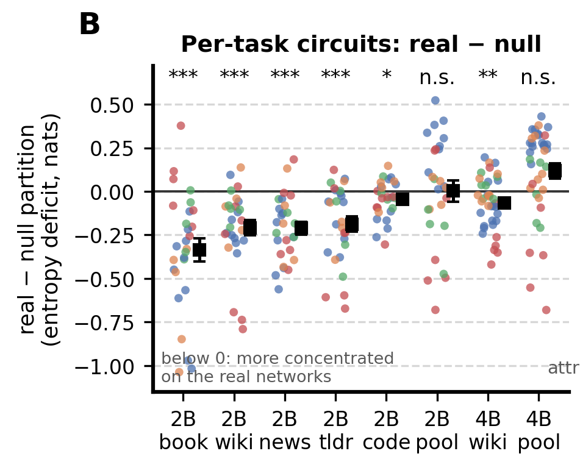

**Question.** Does a circuit fall into fewer networks than chance? **Method.** Concentration = the entropy of the circuit's distribution over the networks (low = few networks). For each partition, the circuit's entropy minus the mean entropy of 1,000 layer-matched random sets on that same partition: the *entropy deficit* (negative = more concentrated than chance). Each partition is judged against its own baseline, which absorbs its network sizes and layout. The headline statistic is the paired difference, deficit on the real networks minus deficit on the null partition, per task (one dot per task, coloured by domain), with a one-sided Wilcoxon test across tasks. **Result.** On the single-dataset networks the real networks win clearly: 74-93% of tasks are more concentrated on the real than on the null partition at 2B for the four prose datasets (mean difference -0.19 to -0.34 nats, p <= 1.5e-4), 63% for code (p = 0.03) and 68% for 4B wikitext (p = 0.01). **On the pooled networks the test fails** (41% of tasks at 2B, 24% at 4B). Against layer-matched random sets alone, real-network circuits are concentrated but moderately: median z about -1.3 to -3.0, roughly 45 effective networks against 50-56.

**Why the pooled test fails.** Not because the pooled networks are worse (their reliability, fidelity and own concentration match the single-dataset ones) but because the pooled *null* partition becomes strongly concentrated for circuits. The graded and enrichment analyses below show that this null concentration does not carry over to other measures (the pooled null partition has zero enriched networks and explains almost nothing on all neurons), so it is a quirk of the entropy measure on that partition. A suspected mechanism, untested: pooling shifted data from five datasets lets the null partition sort neurons by *which datasets they are active in*, a property circuit neurons share.

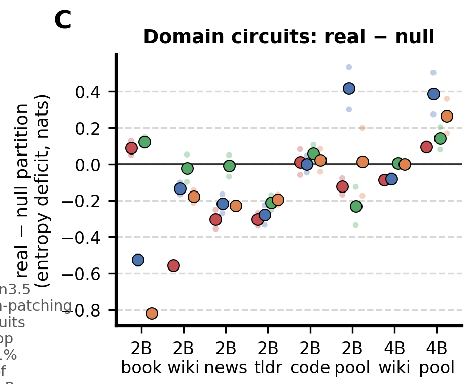

**Domain circuits.** The same paired measure for each domain's circuit, built from the mean attribution map over the domain's tasks (each task rescaled to mean |attribution| = 1 first, so every task counts equally). Mostly negative (real more concentrated) on the prose single-dataset sets, around zero on code, positive on the pooled sets for the reason above. Against layer-matched chance alone, the Language domain circuit is the most robust result of the concentration family: strongly concentrated on the real networks in every set but tldr17 (z -4.7 to -8.7 at 0.1%, down to -16.8 at 1%; about 27-39 effective networks against 46-55; tldr17 z -1.2 and -2.1).

## 4. Do a domain's tasks reuse the same networks? (panel D)

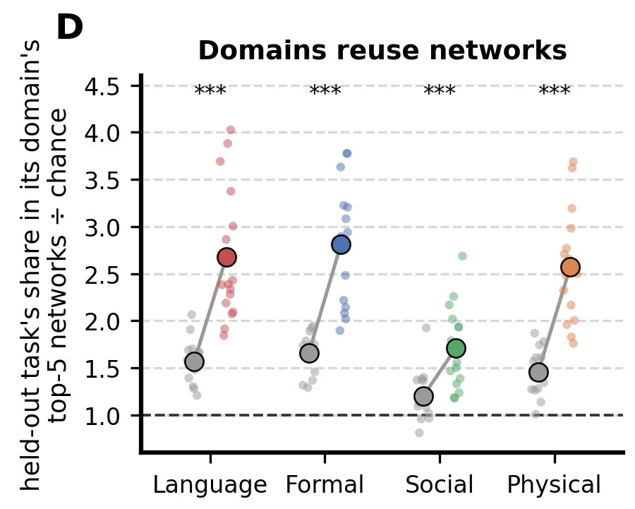

**Question.** The interpretable effect size. **Method.** For each task, take the 5 networks with the largest excess (observed minus layer-matched expected circuit neurons) summed over the *other* tasks of its domain, then measure the held-out task's share of circuit neurons in those 5 networks, divided by its layer-matched expected share. Leave-one-task-out, so the networks are never chosen on the task they are scored on (choosing them in-sample inflated every domain, Social included, and was discarded). One small dot per network set and half; large dots are means; dashed line = chance; Wilcoxon over the 16 set x half values, real > null. **Result.** Language 2.7x on the real networks (null partition 1.6x), Formal 2.8x (1.7x), Physical 2.6x (1.5x), Social 1.7x (1.2x), all p < 0.001. In plain terms: about a quarter of a new Language or Formal task's circuit lands in the five networks its sibling tasks use most (17-33% against 5-13% expected), two to three times chance and about 1.5-2x what neuron-level properties alone produce. At 1% circuits the real ratios are 1.6-1.8x.

## 5. Do tasks that share circuits share networks? (panels E, F)

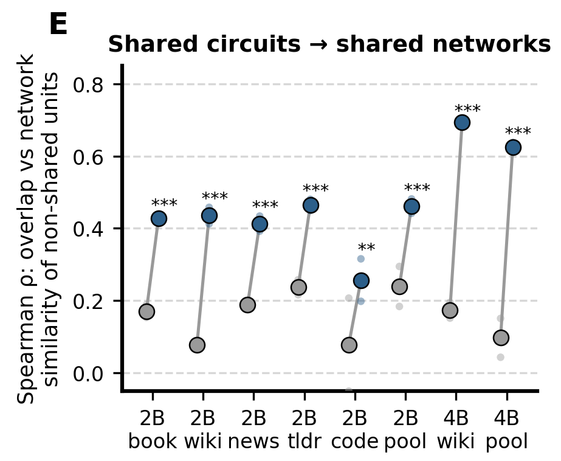

**Question.** The relational test: is the *pattern* of task relationships found by patching reproduced by the networks? **Method.** For each pair of tasks: their circuit overlap (the original's ratio), and the similarity of their network profiles (counts of circuit neurons per network, cosine). A first version compared all circuit neurons and was circular: two circuits that share neurons automatically share those neurons' networks, under any partition, which is why the null partition also looked significant. The final version uses **only the neurons the two circuits do not share**, and subtracts the similarity that layer-matched random sets of the same sizes would have (the cosine of two count vectors grows with the number of neurons counted, so without this correction larger overlaps would look *less* similar). The test suite shows the circularity on a random partition and that the corrected measure removes it. Spearman correlation across task pairs, permutation p over task labels. **Result.** Real networks 0.41-0.47 at 2B on the prose datasets and the pool, 0.26 on code, 0.63-0.70 at 4B; null partition 0.08-0.24. Significant in all eight sets (p <= 0.006). This is the strongest and most general result.

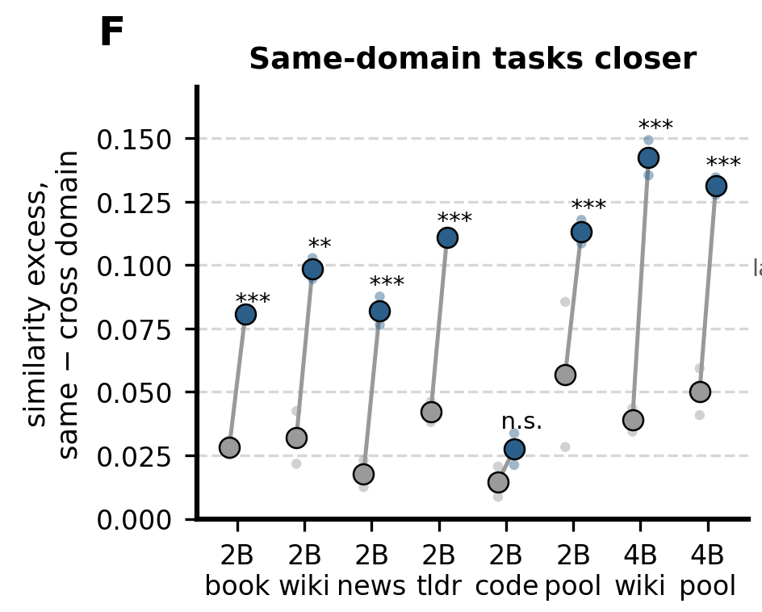

**Same-domain tasks sit closer.** The same corrected similarity, averaged over same-domain pairs minus cross-domain pairs: 0.08-0.14 on the real networks against 0.02-0.06 on the null partition, significant in seven of eight sets; codeparrot is the exception (0.03, n.s.).

## 6. Which networks are over-represented? (panel G)

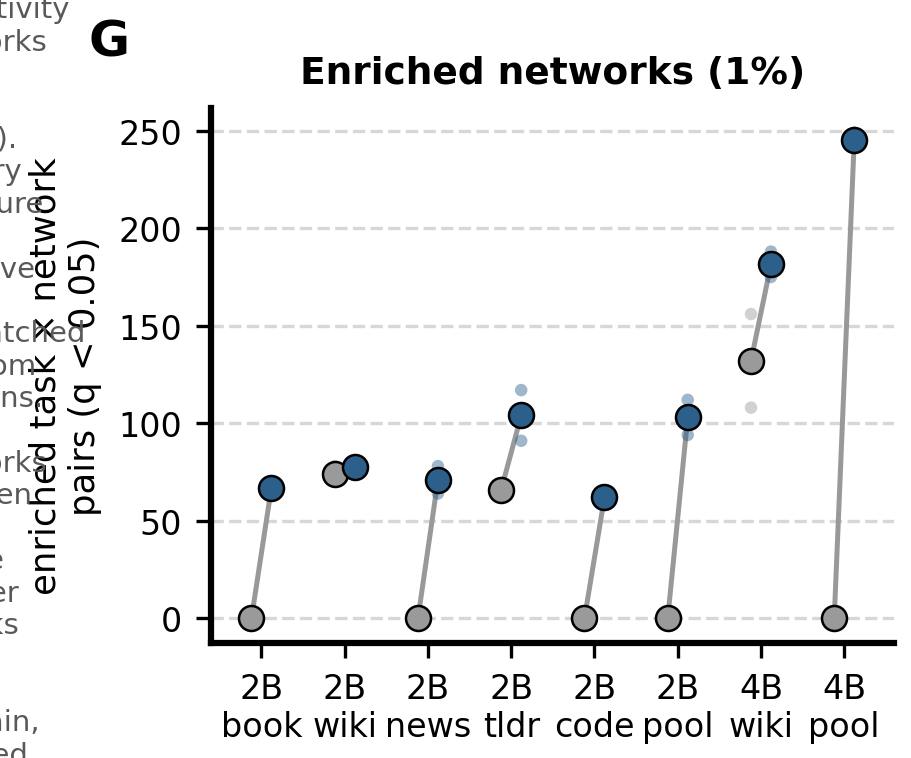

**Method.** For each task and network, the circuit's count against the layer-matched random sets (one-sided p), Benjamini-Hochberg over all task x network pairs of a partition; 1% circuits, since at 0.1% (147-294 neurons) little survives correction. **Result.** The real networks have more enriched task x network pairs than the null partition in every set: 62-104 at 2B against 0-74, 182 and 245 at 4B against 132 and 0. The pooled null partitions have none, which is why their apparent concentration in panel B is not taken at face value. Each domain circuit is over-represented in a handful of networks (about 2-12), and a few networks are shared by two or more domains, candidate domain-general hubs next to domain-specific ones.

## 7. All neurons, no cut: the graded test

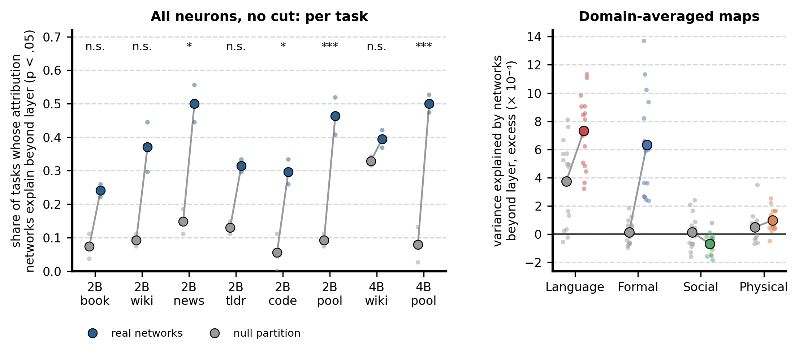

**Question.** Does the top-0.1% cut, and the mismatch between a 147-neuron circuit and networks of about 1,500 neurons, hide a stronger correspondence? **Method.** For each task, rank all neurons by attribution, remove each layer's mean rank, and measure the share of what remains that the network labels explain (eta-squared). Null: network labels permuted within each layer (every layer keeps its count of neurons per network), 200 times; reported as the share of tasks significant at p < 0.05, and the paired real - null comparison (stars: Wilcoxon, worst half). The right panel does the same on the domain-averaged maps. **Result.** Real networks explain attribution beyond layer for 24-50% of tasks against 6-33% on the null partition. The pooled networks, which failed the paired concentration test, pass this one most strongly (2B p = 2e-4 to 8e-4, 4B p = 2e-5 to 3e-6). Domain maps: Language and Formal significant in every set (mean excess 7.3 and 6.3 x 10^-4 against 3.7 and 0.1 x 10^-4 on the null partition), Physical small, Social none. **In absolute terms these effects are tiny** (networks explain 0.01-0.03% of the variance per task, layer 0.1-1.1%), because most of the 147k-295k neurons carry no task signal: the measure is useful for comparisons, not as an effect size. Section 4 gives the interpretable one.

## 8. Granularity: are coarser networks a better match? (2B only)

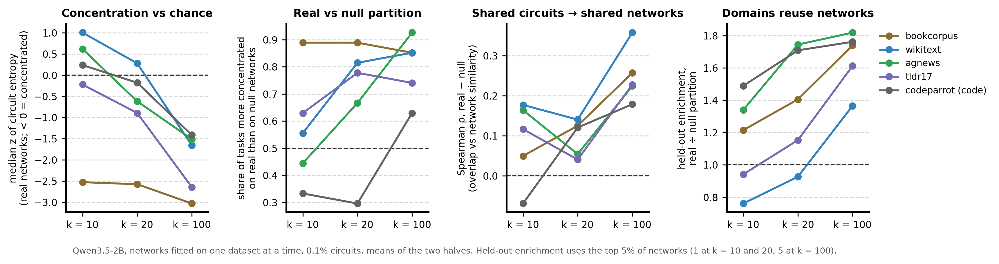

**Question.** k = 100 networks may be finer than the scale at which task domains are organised (brain-like large-scale systems). **Method.** The same pipeline at k = 10 and k = 20 on all five 2B single datasets (wikitext and bookcorpus recomputed into separate trees, never mixed with the k = 100 files), and the same analyses. Held-out enrichment uses the top 5% of networks (1 network at k = 10 and 20, 5 at k = 100), so its values are comparable only roughly across k. **Result.** Coarser is worse. Concentration against chance disappears at k = 10 for four of five datasets (median z around 0, against -1.4 to -3.0 at k = 100); the real-over-null gap in shared structure (third panel) and in held-out enrichment (fourth) is largest at k = 100. **Bookcorpus is the exception**: its circuits stay strongly concentrated and beat the null partition at every k. Codeparrot is the weakest set at every k. A plausible but unchecked reason for the loss: with 10 networks over 147k neurons, networks are largely layer bands, which the layer-matched null removes by design. The coarse pooled 2B networks are still running.

## 9. Reconciling weak concentration with strong structure

The concentration panels (B, C) and the structure panels (D-G) ask different questions. Concentration asks *how few* networks a circuit occupies; it summarises all circuit neurons, and a circuit made of a small concentrated core plus a large remainder scattered at about chance barely moves it. The structure tests ask *which* networks, and pick up a consistent bias even in a spread-out circuit. They also isolate the task-specific part: neuron-level properties make every circuit look somewhat concentrated (circuit neurons are active, influential neurons, and any partition partly sorts neurons by such properties, which is why the null partition is a strong competitor in B), but they are shared by all circuits alike, so they cannot say which *tasks* go together; that is why the null partition does well on concentration and poorly in D-F. And the structure tests pool hundreds of task pairs or many tasks x networks, where B gives one noisy number per task.

The resulting picture: **the networks and the circuits are not the same objects, but they are organised alike.** Related tasks recruit related networks, patching's domain structure reappears in network space, beyond layers and beyond neuron-level properties, and a domain's circuits concentrate partly (about a quarter of their neurons) in a few shared networks.

## 10. Caveats and open items

- The 4B comparison rests on two network sets (wikitext, pooled); the four further 4B single-dataset sets are running (Iteration 34).
- The coarse k = 10/20 pooled 2B networks are running.
- The pooled null partition's entropy behaviour is explained only by hypothesis (dataset-specific activity); testing it needs per-dataset neuron statistics, recomputable with forward passes only (about 1 GPU-hour per model).
- Social reasoning shows the weakest correspondence everywhere, but its tasks also lack a shared circuit on the patching side (section 2), so the comparison has little to work with there.
- Codeparrot networks, fitted on code, match the mostly linguistic task circuits least well, as one would expect.
- The inclusion rule (both-correct >= 0.60 and >= 300 items) keeps 27 of 46 tasks at 2B and 38 at 4B; Social and Physical have 5-9 tasks per domain, so their per-domain statistics have little power.

## Reproducing

| what | where |
|---|---|
| tests and their implementation | `parcelmate/circuits.py` (concentration, enrichment, structure, paired real - null, graded, held-out enrichment, domain overlap); tests in `tests/verify_iter16_circuits.py` (27 checks) |
| command-line runs | `parcelmate/bin/compare_circuits.py`, `graded_circuits.py`, `paired_circuits.py`; cluster jobs from `scripts/launch_circuits.sh` |
| networks | `scripts/make_qwen_configs.py`, `scripts/launch_qwen.sh`, `scripts/launch_coarse.sh`; configs in `configs/qwen35/` |
| per-run tables | `results/qwen35/<tree>/circuits*/` (concentration, enrichment, structure, paired, graded, domain tables) |
| figures | `figures/make_circuits_figure.py` (overview and panels A-G; values in `figures/circuits_networks.csv`), `figures/make_circuits_extra_figures.py` (schematic, graded, granularity; values in `figures/circuits_extra.csv`) |
| full record | `info/LOG.md`, Iterations 30-35 |
