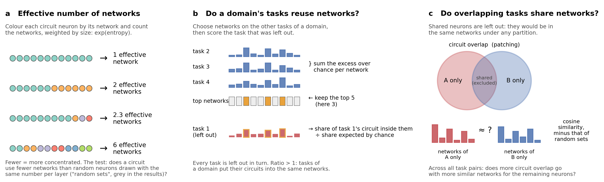
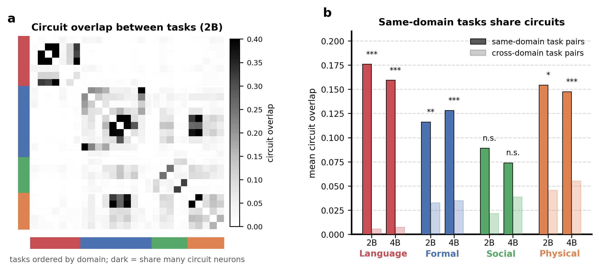
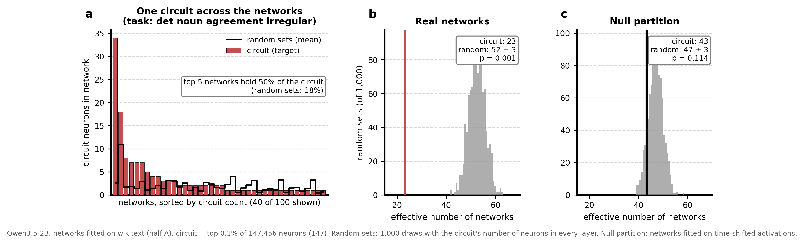
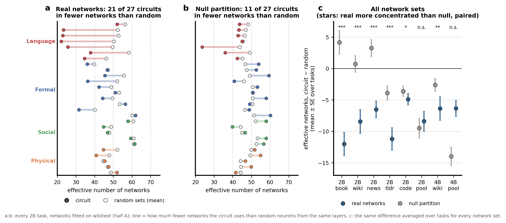
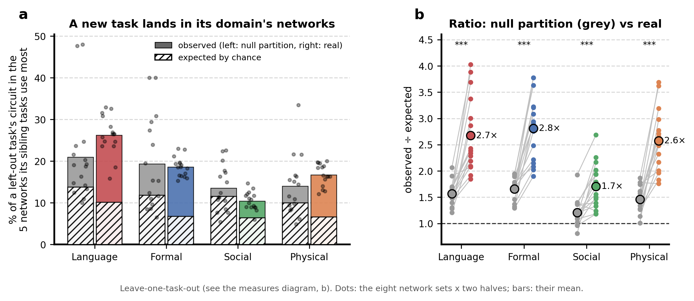
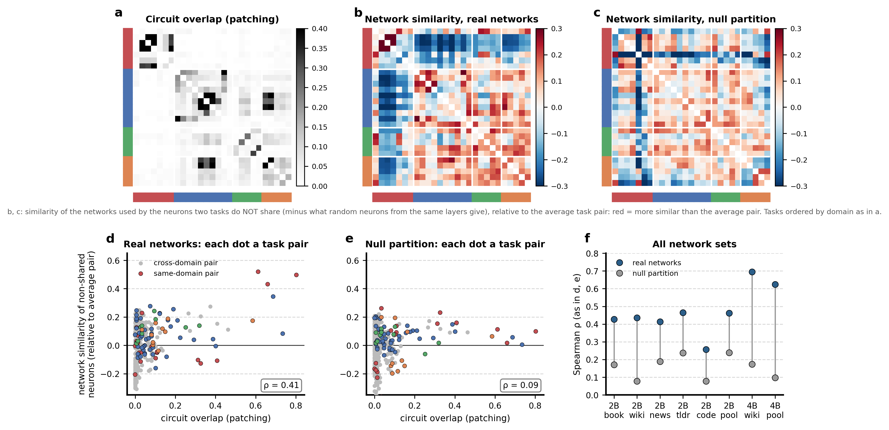

# Patching circuits against connectivity networks (Qwen3.5-2B and 4B)

Do two very different ways of finding functional units in a language model find the same neurons? **Attribution patching** finds, for each task, the neurons that most drive the model's correct answer (a *circuit*). **Connectivity parcellation** (this project's pipeline) groups all MLP neurons into *networks* by how they co-activate on ordinary text, with no tasks involved. This page summarises every analysis comparing the two (LOG.md Iterations 30-36, 2026-09-23 to 2026-10-01). Four further 4B single-dataset network sets and the coarse pooled 2B networks were still running when it was written.

## In short

- **The circuits are not the networks.** A circuit (the top 0.1% of neurons: 147 at 2B, 294 at 4B) typically spreads over about 45 of the 100 networks, against about 50 for random neurons from the same layers. A few circuits are strongly concentrated (one Language task: 23 effective networks against 52), most only a little.
- **But the networks carry the circuits' organisation.** Tasks whose circuits overlap also send their *other* neurons to similar networks (Spearman 0.26-0.70 on the real networks against 0.08-0.24 on the null partition, all eight network sets). A left-out task puts about a quarter of its circuit into the five networks its sibling tasks use most: 2.6-2.8 times chance for Language, Formal and Physical, against about 1.5 times for a partition that keeps only properties of individual neurons.
- **Language and Formal are the clearest domains; Social is the weakest everywhere**, already on the patching side, where its tasks barely share circuit neurons.
- **The fine networks (k = 100) carry the signal**; coarser ones (k = 10, 20) lose most of it, except on bookcorpus.

## Setup

**Models.** Qwen3.5-2B (24 layers x 6,144 MLP neurons = 147,456) and Qwen3.5-4B (32 x 9,216 = 294,912). Every MLP neuron is used on both sides.

**Patching.** The 46 minimal-pair tasks of LLM_Modularity (Pengrui Han et al.) in four domains: Language (`Lan`), Formal reasoning (`MD`), Social reasoning / theory of mind (`ToM`), Physical reasoning (`phys`). Reimplemented in plain PyTorch, float32, with the original's token-alignment filter. A task is kept if the model is "both-correct" (prefers the right answer on the clean prompt and flips on the corrupted one) on at least 60% of at least 300 items: 27 tasks at 2B (Language 7, Formal 10, Social 5, Physical 5) and 38 at 4B (7, 16, 6, 9). Each neuron's attribution is activation x gradient of the logit difference; the **circuit** is the top 0.1% of all neurons by positive attribution, exactly as the original code selects it (1% as a check).

**Connectivity.** Each neuron's activation timecourse over ordinary text, the |r| connectome between all neurons, then the pipeline confirmed on GPT-2 (Fisher-transformed standardized profiles sparsified to their top 10%, PCA-100, k-means with 200 restarts and a Hungarian consensus): **k = 100 networks**, fitted on two independent halves of the data. Network sets (x axes below): 2B fitted on one dataset at a time (book = bookcorpus, wiki = wikitext, news = agnews, tldr = tldr17, code = codeparrot Python) or on all five pooled (pool); 4B on wikitext and pooled. Pooling is used here, unlike elsewhere in the project, because patching is an independent localiser (no double dipping). Network quality, split-half against the null partition: reliability (ARI) 0.58-0.72 against 0.01-0.03, held-out fidelity r = 0.38-0.42 against 0.16-0.21.

**Two references.** *Random sets*: random neurons with exactly the circuit's number of neurons in every layer (both methods favour certain layers, and networks are partly layer-local, so this match is essential). *Null partition*: the same pipeline run on activations whose timecourses were circularly shifted, so each neuron keeps its own statistics (mean, variance, autocorrelation, how often it fires) but co-activation between neurons is destroyed. What the real networks show beyond the null partition comes from co-activation, not from properties of single neurons.

## The three measures

**a. Effective number of networks.** Each circuit neuron belongs to one network; the effective number is exp(entropy) of the circuit's distribution over networks: 1 if all neurons are in one network, 2 if split evenly over two, 6 if spread evenly over six, 2.3 for 9 neurons in one network and 3 elsewhere. The concentration test compares a circuit's effective number with that of 1,000 random sets.

**b. Held-out network reuse.** For a domain, leave one task out; on the other tasks, sum each network's excess circuit neurons over chance and keep the top 5 networks; then measure the share of the left-out task's circuit inside those networks, divided by the share expected for random sets. Repeated with every task left out. Ratio > 1 means the domain's tasks put their circuits into the same networks. (Choosing the networks on the same task they are scored on would inflate every domain.)

**c. Shared structure on non-shared neurons.** For two tasks, the circuit overlap is the original's ratio (share of A's circuit neurons also in B's). Their network similarity is the cosine between the network profiles of the neurons each has *alone*, minus the same for random sets. Shared neurons are excluded because they sit in the same networks under any partition, which would make overlap and network similarity agree by construction (the first version of this test had exactly that flaw, and the null partition passed it too).

## 1. The patching domains are coherent

**a.** Circuit overlap between every pair of 2B tasks, ordered by domain: the dark cells sit mostly inside the domain blocks. **b.** Mean overlap of same-domain pairs (full colour) and cross-domain pairs (light), permutation test over task-domain labels. Language (0.18 against 0.006 at 2B, 0.16 against 0.007 at 4B), Formal (0.12 against 0.03; 0.13 against 0.04) and Physical (0.15 against 0.05 in both) share far more circuit neurons within their domain. **Social does not** (2B p = 0.055, 4B p = 0.11): its tasks have little common circuitry, which caps what any network comparison can find for it.

## 2. Concentration: does a circuit fall into few networks?

**Worked example** (2B, wikitext networks, task *det_noun_agreement_irregular*). **a.** The circuit's 147 neurons per network (red bars), networks sorted by count, against the mean of the random sets (black line). The circuit piles up in a few networks: its top 5 networks hold 50% of its neurons, against 18% for random sets. **b.** So its effective number of networks is 23, far below the 1,000 random sets (52 ± 3, p = 0.001). **c.** On the null partition the same circuit is not unusual (43 against 47 ± 3, p = 0.11): the concentration comes from co-activation, not from neuron properties.

**All tasks.** **a, b.** Each line is one 2B task (wikitext networks, half A): the circuit's effective number of networks (filled) against the random sets' mean (open). On the real networks 21 of 27 circuits use fewer networks than random sets, most strongly the Language tasks; on the null partition 11 of 27, with smaller gaps. **c.** The same gap (circuit minus random), averaged over tasks, for every network set; stars: one-sided Wilcoxon over tasks that the real networks concentrate circuits more than the null partition does. The real networks reduce the effective number by about 5-12 networks in every set, a moderate effect. They beat the null partition in all single-dataset sets (p < 0.05; strongest on the prose datasets), but not on the pooled sets. There the pooled null partition is unexpectedly concentrated too (2B pool: -9.5; 4B pool: -14). This null concentration does not show up on the other measures: the pooled null partitions have no enriched networks and explain almost nothing in the graded test, so it looks like a quirk of entropy on those partitions. A possible mechanism, untested: pooling shifted data from five datasets lets the null partition sort neurons by which datasets they are active in, a property circuit neurons share.

## 3. Domains reuse networks

**a.** The share of a left-out task's circuit in the five networks its sibling tasks use most (filled bars), against the share expected for random sets (hatched), on the null partition (grey, left) and the real networks (coloured, right). Dots: the eight network sets x two halves. On the real networks about a quarter of a left-out Language circuit (26%) and a fifth of a Formal or Physical one lands in those five networks, against 7-10% expected. **b.** Observed ÷ expected, each grey-to-colour line one network set and half: Language 2.7x, Formal 2.8x, Physical 2.6x, Social 1.7x, against 1.2-1.7x on the null partition (all p < 0.001, real > null). This is the most interpretable effect size: domains reuse a small set of networks, but most of a circuit still lies elsewhere. At 1% circuits the real ratios are 1.6-1.8x.

## 4. Tasks that share circuits share networks

**a.** Circuit overlap between 2B tasks (as in fig. 1). **b, c.** Network similarity of the neurons each pair does *not* share, relative to the average pair (red = more similar than average), on the real networks and the null partition, same task order. On the real networks the Language block and the high-overlap pairs stand out; on the null partition there is no structure tied to the tasks. **d, e.** Each dot one task pair: circuit overlap against that network similarity, same-domain pairs in the domain colour. On the real networks, more overlap goes with more similar networks for the remaining neurons (Spearman 0.41); on the null partition it does not (0.09). **f.** The same correlation for every network set: 0.41-0.47 on the 2B prose and pooled sets, 0.26 on code, 0.63-0.70 at 4B, against 0.08-0.24 on the null partitions, significant everywhere. Same-domain pairs are also more similar than cross-domain pairs on the real networks (excess 0.08-0.14 against 0.02-0.06, seven of eight sets; not on code). Enrichment tells the same story: the real networks have more significantly over-represented task x network pairs than the null partition in every set (62-245 against 0-132, 1% circuits), and the pooled null partitions have none.

## 5. All neurons, no cut: the graded test

**Question.** Is the top-0.1% cut hiding a stronger correspondence? **Method.** For each task, rank all neurons by attribution, remove each layer's mean rank, and measure the share of the rest explained by the network labels; null: labels permuted within each layer, 200 times. **Result.** Real networks explain attribution beyond layer for 24-50% of tasks against 6-33% on the null partition (left; stars: paired real > null, worst half), most strongly on the pooled sets (p = 2e-4 to 3e-6), which supports reading their failure in fig. 3c as a quirk of the null partition. Domain-averaged maps (right): Language and Formal clearly above the null partition, Physical marginal, Social none. In absolute terms the variance explained is tiny (0.01-0.03% per task; layer 0.1-1.1%), because most of the 147k-295k neurons carry no task signal. The measure is useful for comparisons, and fig. 4 gives the interpretable effect size.

## 6. Granularity: are coarser networks a better match? (2B only)

The same pipeline at k = 10 and 20 on the five 2B single datasets (wikitext and bookcorpus recomputed into separate trees). Coarser is worse. Concentration disappears at k = 10 for four of five datasets (median z around 0 against -1.4 to -3.0 at k = 100), and the real-over-null advantage in shared structure and in held-out reuse is largest at k = 100. **Bookcorpus is the exception**, concentrated at every k (it also has the most reliable networks, 0.72). Codeparrot is the weakest at every k. A plausible, unchecked reason: 10 networks over 147k neurons are largely layer bands, which the layer-matched random sets remove by design. Held-out reuse uses the top 5% of networks (1 at k = 10 and 20), so its values are only roughly comparable across k.

## Reconciling weak concentration with strong structure

Concentration asks *how few* networks a circuit occupies. It summarises all circuit neurons, so a small concentrated core plus a large remainder scattered at about chance barely moves it (fig. 2a shows such a profile, here with an unusually large core). The structure measures ask *which* networks, and pick up a consistent bias even in a spread-out circuit. They also isolate what is task-specific. Properties of single neurons make every circuit look somewhat concentrated (circuit neurons are active, influential ones, and any partition partly sorts neurons by such properties, hence the null partition's partial concentration). But those properties are shared by all circuits alike, so they cannot say which *tasks* go together; that is why the null partition fails in figs. 4 and 5.

**The networks and the circuits are not the same objects, but they are organised alike:** related tasks recruit related networks, the patching domains reappear in network space beyond layers and neuron properties, and a domain's circuits concentrate partly (about a quarter of their neurons) in a few shared networks.

## Caveats and open items

- 4B rests on two network sets so far; four more 4B single-dataset sets are running. The coarse pooled 2B networks are running.
- The pooled null partition's entropy behaviour is explained only by hypothesis; testing it needs per-dataset neuron statistics (forward passes only, about 1 GPU-hour per model).
- Social reasoning lacks a shared circuit on the patching side, so the comparison has little to work with there.
- Social and Physical have 5-9 tasks each, so their per-domain statistics have little power.
- The worked example (figs. 2, 3a-b, 5a-e) is 2B wikitext half A; its values match the production tables (its random sets use the production seeds); the similarity matrices in fig. 5 use their own random draws.

## Reproducing

| what | where |
|---|---|
| measures | `parcelmate/circuits.py` (concentration, enrichment, structure, paired real - null, graded, held-out reuse, domain overlap); tests in `tests/verify_iter16_circuits.py` (27 checks) |
| runs | `parcelmate/bin/compare_circuits.py`, `graded_circuits.py`, `paired_circuits.py`; cluster jobs `scripts/launch_circuits.sh`; networks `scripts/launch_qwen.sh`, `scripts/launch_coarse.sh`, configs `configs/qwen35/` |
| tables | `results/qwen35/<tree>/circuits*/` |
| figures | `figures/export_circuit_figdata.py` (worked-example data, `figures/circuits_example_2b_wikitext.npz`), `figures/make_circuits_explained.py` (measures diagram, figs. 1-5), `figures/make_circuits_extra_figures.py` (schematic, graded, granularity); the earlier multi-panel overview is in `supplementary/` |
| record | `info/LOG.md`, Iterations 30-36 |
