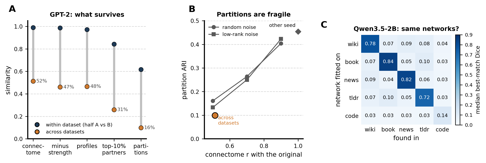
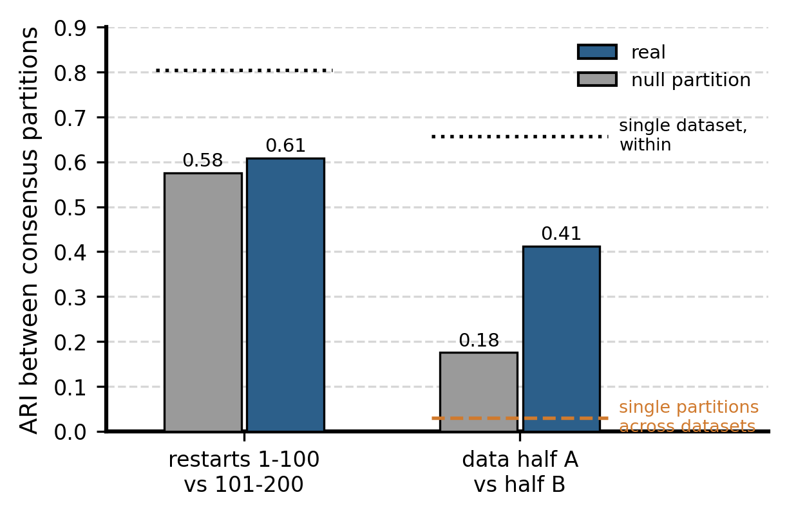
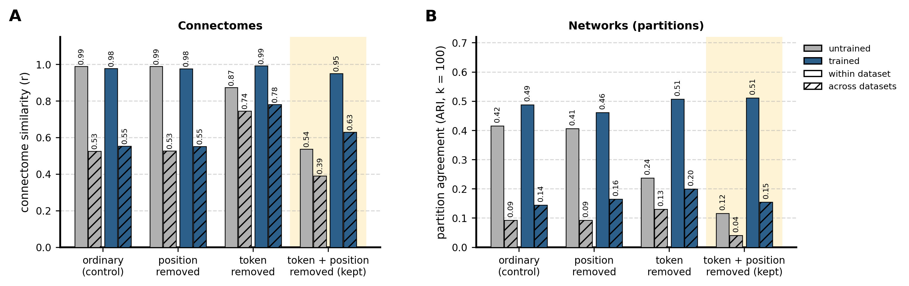

# Stable networks across datasets, and what the connectome is made of

A summary of the work since 2026-10-07, when Andrea set five items: (1) a cross-dataset consensus from half the stored restarts, checked against the other half; (2) graded stability metrics; (3) find the components behind "the connectome is stable within a dataset but not across", and remove them to get a connectome stable within and across datasets in trained models but not in untrained ones; (4) leave codeparrot out of stability definitions; (5) redo the patching comparison on the consensus networks. It also includes the diagnosis that motivated the items (2026-10-06 and 07). Full record in `info/LOG.md`, Iterations 36-38; every number here is in a table under `figures/` or `results/`.

## In short

- **The problem was in the partition, not in the connectome.** Connectomes of different prose datasets correlate about 0.5 (GPT-2) or 0.3 (Qwen3.5-2B), but hard k = 100 partitions of them agree at ARI 0.1 or less. Hard partitions are fragile: random noise that leaves a connectome correlated 0.5 with the original produces the same drop.
- **The ordinary connectome is a token-identity connectome.** It equals the connectome of each token type's mean activation, weighted by how often each type occurs. That makes it equally reproducible in untrained models, and makes datasets disagree in proportion to their word frequencies.
- **The residual connectome needs training, but is only modestly more shared.** It is what remains of each activation after a joint least-squares fit of what the token type and the position predict. In the untrained Pythia-70m it is unreliable (within 0.54, across 0.39), unlike the ordinary connectome (0.99 / 0.53); in the trained model it is reliable (0.95) and somewhat more shared across datasets than the ordinary one (0.63 against 0.55). Its networks are not more shared (ARI across 0.15 against 0.14). An earlier, larger gain (0.81, networks 0.38) was an artifact of subtracting position averages taken on raw activations; it is corrected below.
- **A cross-dataset consensus of the existing Qwen partitions replicates** (ARI 0.41 between independent data halves, null 0.18). But it does not match the patching circuits better than single-dataset networks do.

## 1. The diagnosis (before the five items)

**A. What survives across datasets** (GPT-2 final arm, 9,984 MLP units, 4 prose datasets; `scripts/diag_partition_fragility_1.py`). "Within" compares half A and half B of one dataset; "across" compares half A of one dataset with half B of another.

| | within | across | what is compared |
|---|---|---|---|
| connectome | 0.99 | 0.51 | Pearson r between the two |r| matrices (3 million sampled neuron pairs) |
| connectome, strength removed | 0.99 | 0.46 | the same after double-centring (below) |
| neuron profiles the pipeline clusters | 0.97 | 0.47 | per neuron, Pearson r between its two profiles (its row after Fisher transform, row z-score and top-10% sparsification); median over neurons |
| partitions | 0.62 | 0.10 | adjusted Rand index between the two k = 100 partitions (0 = chance, 1 = identical) |

*Double-centring.* From every entry of the |r| matrix subtract the two neurons' mean |r| (their overall strength) and add back the grand mean: M′ᵢⱼ = Mᵢⱼ − sᵢ − sⱼ + ḡ. It centres rows and columns (nothing is divided) and leaves only whether two neurons are more or less coupled than their overall strengths predict. It tests whether the across-dataset similarity is just "the same neurons are hubs everywhere": strengths do agree across datasets (r = 0.71) and explain about a fifth of the variance of |r|, but removing them leaves 0.46 of the 0.51.

About half of the similarity survives all the way to the profiles the pipeline clusters; the partitions keep much less. Note that ARI is on a different scale from r, so the drop in the last row is not a like-for-like loss; panel B puts the two on the same footing. Ablating sparsification or z-scoring, clustering raw |r|, or using k = 20 does not change the across/within ratio of the partitions.

**B. Hard partitions are fragile** (`scripts/diag_partition_fragility_2.py`). Random noise added to one connectome, reducing its correlation with the original to 0.9, 0.7 and 0.5, drops partition ARI to about 0.41, 0.26 and 0.15. The cross-dataset point (0.51, 0.10) sits on that curve. Re-clustering the same matrix with another seed gives 0.45. So label identity is a steep function of connectome similarity, and low cross-dataset ARI does not mean networks are dataset-specific. On graded measures, labels transfer as much as the connectome does: one dataset's partition, applied to another dataset, keeps 45% of the own partition's advantage over the null partition, and pairs of units in the same network stay together 10 times more often than chance.

**C. Qwen3.5-2B, best-match overlap (Dice) of networks.** Each prose dataset reproduces its own networks (0.72-0.84) but not those of other datasets (0.04-0.10). Codeparrot does not even reproduce itself (0.14; its connectome's split-half correlation is 0.55, against 0.96-0.99 for prose). An earlier "stable networks" analysis based on identical labels (Iteration 36) therefore understated the shared structure, especially because its "4 of 5 datasets" criteria effectively required the unreliable codeparrot. Circuits did not favour the units with identical labels everywhere (0.7-1.2x chance), so stability by label identity was dropped as a filter.

## 2. Item 1: cross-dataset consensus from the stored restarts

**Method** (`parcelmate/bin/restart_consensus.py`). Every dataset's partition is fitted within that dataset, as always; each keeps its 200 k-means restarts. The consensus treats all restarts of all four prose datasets (800 labelings) as votes on which units belong together: the co-association matrix (share of labelings in which two units share a network), clustered into k = 100. At 147k units that matrix has 22 billion entries, so its leading 100 eigenvectors are obtained from the labelings directly (truncated SVD of the one-hot labels, mathematically equivalent), then k-means. Each unit gets a confidence, the average share of its consensus network's members that share its label across the labelings.

**Result, Qwen3.5-2B.**
- **Restarts 1-100 against 101-200 (your check): ARI 0.61** (null partition 0.58). The consensus does not depend on which restarts built it. But both halves of this split use the same data, which is why the null partition passes it too. The single-dataset analogue is 0.81.
- **Half A against half B of the data: ARI 0.41** (null 0.18). The halves are independent tokens, so this is the replication that supports claims. It is far above the ~0.03 at which single-dataset partitions agree across datasets; a single dataset reaches 0.66 within itself. Unit confidence correlates 0.86 between data halves.
- **Mean confidence 0.17** (10th-90th percentile 0.04-0.33). A consensus network is a set of units that tend to co-occur across datasets, not a network present intact in any single one.
- GPT-2 gives the same pattern (0.52 and 0.46; null 0.37 and 0.15).

## 3. Item 2: graded stability metrics

Kept as the standard: **co-membership** (if two units share a network in one dataset, how often do they share one in another, against chance) and **label-transfer fidelity** (one dataset's partition, block means refitted on another dataset's half A, scored on its half B, as a share of the target's own partition's advantage over the null partition). Neither treats a split or merged network as a failure.

## 4. Item 3: why the connectome changes across datasets, and the residual connectome

### The question

The ordinary connectome is almost perfectly reproducible within a dataset (r = 0.99) but only half-shared across datasets (r ≈ 0.5), and this is already true in an untrained model. An untrained model has learned nothing, so whatever makes datasets differ there comes from the text itself, not from language processing. The goal was a connectome that (a) is reliable within a dataset, (b) is shared across datasets, and (c) needs training to show both.

### The idea: separate what the input predicts from what is left

Take one MLP neuron and one token in context. Its activation can be written as

**activation = a(token type) + b(position in the window) + residual**

- **a(token type)** is the neuron's typical activation for that token type (for example every " the"), **b(position)** its typical shift at that position of the 1,024-token window (b has zero mean over tokens).
- The **residual** is what the neuron does on this occasion beyond those two: its response to the context.
- A connectome is the correlation across tokens between neurons. The **ordinary connectome** correlates the full activations; the **residual connectome** correlates only the residuals.

**How a and b are estimated.**
- *Data.* Each dataset gives a reference portion: the text that follows the analysed text in the same document stream, never overlapping it. The four prose datasets' portions are pooled, and a and b are fitted on that pool only, so the two halves that are compared stay independent. (In the exploration below: 4 × 163,840 tokens. In the training-dynamics rerun: 4 × 196,608 tokens.)
- *Fit.* a and b are estimated jointly by ordinary least squares, the regression of the activation on token-type and position dummy variables, for every neuron. It is exact and cheap: the regression only needs per-type sums, per-position sums and a type-by-position count table, collected in one pass over the reference, then solved by alternating the two closed-form updates until they stop changing (4-7 iterations). A test checks it against an explicit regression with dummy variables (equal to 3 × 10⁻⁸).
- *Rare tokens.* Token types seen fewer than 3 times in the reference are dropped from the fit and from the analysed text: 2-5% of tokens.

**Why a joint fit, and not two subtractions.** A first version subtracted raw token means and then raw position means. That inflated the cross-dataset agreement (to 0.80) and is wrong. Raw position means are not only a position effect: each also contains the average token profile of the few hundred reference tokens that happen to sit at that position. That average is sampling noise, but it is shaped like the token-identity connectome, and the same pattern was subtracted from every dataset. Building that average from tokens taken at *random* positions reproduces the entire gain (0.79), while a random pattern without that shape produces none (0.73, the same as the joint fit). The joint fit separates the two factors and is the method used from here on. The previous-token term of the earlier version is also gone: adding it changed nothing (Iteration 39 of the LOG).

### Why the ordinary connectome differs across datasets

If every activation is replaced by its token type's typical activation, the connectome barely changes: it is essentially a *token-identity connectome*. Two neurons correlate because they respond to the same token types, weighted by how often those types occur in the text. Datasets use different words at different rates (wikitext has numbers and markup, Reddit has "I" and informal spelling), so they weight the token types differently and give different connectomes, even through random weights. Reweighting tokens so that every dataset has the same word-frequency profile raises the untrained model's across-dataset agreement from 0.53 to 0.87; after training it only reaches 0.64, so in a trained model something beyond word frequency differs between datasets.

### Result

Pythia-70m (12,288 MLP neurons), four prose datasets, 40,960 tokens per half; one run for both panels (run 9). Grey = untrained, blue = trained (final checkpoint); plain bars = within a dataset, hatched = across datasets (mean over dataset pairs).

| | untrained, within / across | trained, within / across |
|---|---|---|
| **A. connectome (r)** | | |
| ordinary (control) | 0.99 / 0.53 | 0.98 / 0.55 |
| position removed | 0.99 / 0.53 | 0.98 / 0.55 |
| token removed | 0.87 / 0.74 | 0.99 / 0.78 |
| **token + position removed (kept)** | **0.54 / 0.39** | **0.95 / 0.63** |
| **B. networks (ARI, k = 100)** | | |
| ordinary (control) | 0.42 / 0.09 | 0.49 / 0.14 |
| position removed | 0.41 / 0.09 | 0.46 / 0.16 |
| token removed | 0.24 / 0.13 | 0.51 / 0.20 |
| **token + position removed (kept)** | **0.12 / 0.04** | **0.51 / 0.15** |

How to read it:
1. **Ordinary (control).** Perfectly reliable whether or not the model is trained, and half-shared across datasets either way. Training makes almost no difference, which is the problem: this connectome mostly reflects the input.
2. **Position removed.** Changes nothing: position effects are small next to token effects.
3. **Token removed.** Makes connectomes more shared across datasets (0.55 → 0.78), but the untrained model gains just as much (0.53 → 0.74). So the extra agreement is not learned. What is left once the token is removed still contains position effects, which are the same in every dataset, and they make datasets look alike.
4. **Token + position removed (kept).** In the untrained model this connectome is unreliable (0.54 within, 0.39 across): once token and position are accounted for, a random network has little reproducible structure left. In the trained model it is reliable (0.95) and somewhat more shared than the ordinary connectome (0.63 against 0.55). Its networks are as reliable within a dataset as ordinary networks (0.51 against 0.49) but not more shared across datasets (0.15 against 0.14).

**Bottom line.** Criterion (c) is met clearly: the residual connectome is a property of the trained model, not of the text passed through random weights. Criterion (b) is met only modestly at the connectome level and not at the level of networks. The cross-dataset differences of the ordinary connectome are largely word frequencies; what remains after removing token and position is context-driven co-activation, still partly dataset-specific.

### What remains open

- The size of the residual connectome's cross-dataset gain varies with the text sampled: on a different draw of documents it was 0.73 against 0.66 for token removal. The ordering untrained < trained and residual > ordinary held in every sample; the comparison with "token removed" did not. The training-dynamics rerun (in progress) uses the full pipeline and four times more text per half, and will give firmer numbers.
- The trained residual connectome is still much less shared across datasets (0.63) than within (0.95).

## 5. Item 4: codeparrot

Excluded from the consensus and from stability definitions (unreliable even within itself at 2B). It is kept in the other analyses with that caveat; code also has the lowest cross-dataset agreement under every connectome variant.

## 6. Item 5: patching circuits against the consensus networks

The consensus labels were written as an ordinary partition (`parcelmate/bin/consensus_tree.py`), so every circuit test ran unchanged. Qwen3.5-2B, 27 tasks. Each panel shows real networks (blue) against the null-partition consensus (grey), next to the four single-dataset sets for comparison.
- **A. Tasks sharing circuit neurons share networks** (non-shared units): 0.46-0.48 against 0.29-0.34.
- **B. Held-out enrichment** (a new task's share in its domain's top-5 networks, against chance), mean over domains: 2.3x against 1.9x. By domain: Language 2.73x (null 2.02x), Physical 2.66x (1.95x), Social 1.69x (1.22x), Formal 2.12x (2.04x).
- **C. Graded test on all units:** 44-48% of tasks explained beyond layer, against 7-22%; real beats null for 78-85% of tasks (p ≤ 0.007).
- **Enriched task × network pairs** (1%): 112-115 against 60-70.
- **The paired concentration test fails** (22-37% of tasks more concentrated on real than null), as it did on the pooled networks.

The consensus networks carry the circuits about as well as single-dataset networks, not better. The null consensus is a stronger competitor than single-dataset null partitions, because averaging many null partitions removes their noise and keeps what they share: neuron-level properties.

## What this suggests

1. **The residual connectome is the training-dependent part of the connectome**, and the training-dynamics rerun on it is in progress (Pythia-70m and 160m, full pipeline). Whether its networks are worth using for the circuit comparison depends on that rerun: here they are not more shared across datasets than ordinary networks.
2. **Measure stability with graded metrics** (co-membership, label transfer), never by identical labels.
3. **The consensus of existing partitions is reproducible but adds nothing for the circuits.**
4. **Open:** what makes the trained residual connectome still dataset-specific; whether more text per half stabilises the numbers.

## Cluster state (2026-10-08)

- 4B: bookcorpus, agnews and tldr17 are done; codeparrot is clustering, followed automatically by the cross-dataset cohesion analysis (D), scoring, and the 4B circuit comparison.
- The 4B agnews connectivity failed on a 40 GB GPU, which I caught five days late; it was fixed (memory-adaptive tiles) and rerun successfully.
- No other failures.
- Disk: 1.8 TB under Andrea's directory (4B connectivity awaiting purge), 35 TB free on the share.

## Files

| what | where |
|---|---|
| figures | this folder, made by `figures/make_stability_report.py` |
| diagnosis | `scripts/diag_partition_fragility_{1,2}.py`, `figures/diag_partition_*.csv` |
| stability (identical labels, Iteration 36) | `parcelmate/stability.py`, `parcelmate/bin/stability.py`, `results/qwen35/stability_2b{,_prose}/` |
| consensus | `parcelmate/bin/restart_consensus.py`, `figures/consensus_2b_prose_summary.csv` |
| components and residual connectome | `scripts/explore_connectome_components.py`, `figures/explore_connectome_run{1..5}*.csv` |
| consensus vs circuits | `parcelmate/bin/consensus_tree.py`, `results/qwen35/consensus_2b_prose_tree/circuits/` |
| tests | `tests/verify_iter18_stability.py` (15 checks) |
