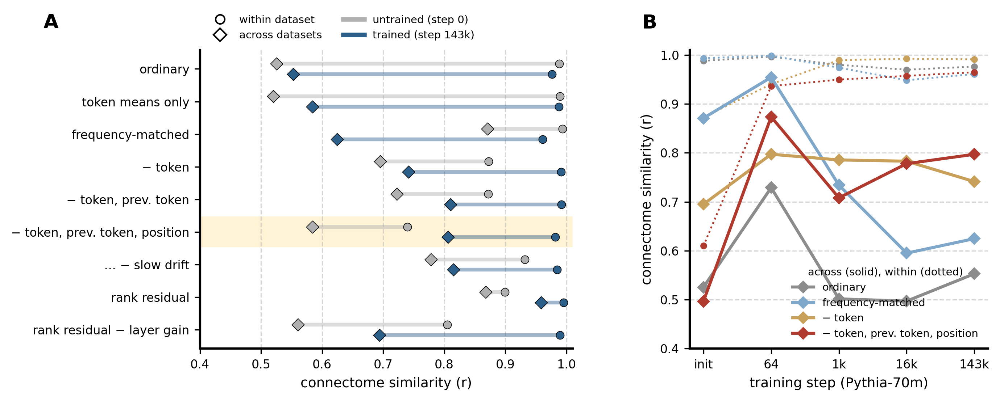
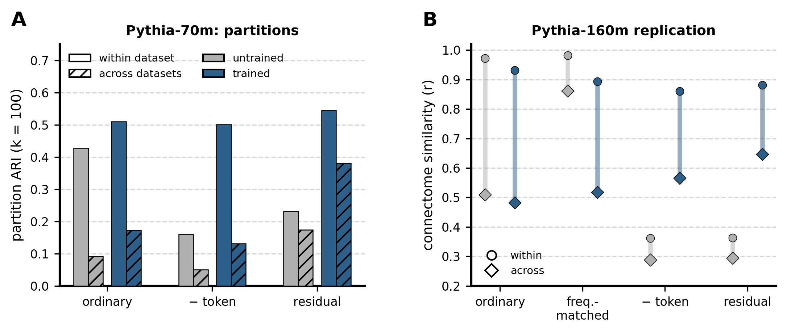
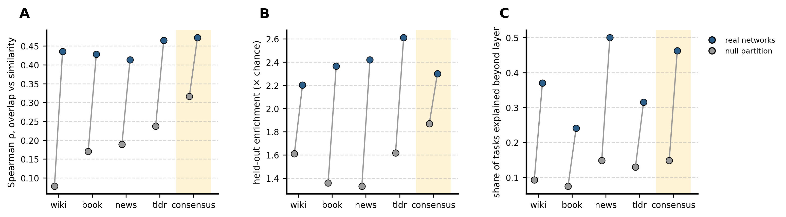

# Stable networks across datasets, and what the connectome is made of

A summary of the work since 2026-10-07, when Andrea set five items: (1) a cross-dataset consensus from half the stored restarts, checked against the other half; (2) graded stability metrics; (3) find the components behind "the connectome is stable within a dataset but not across", and remove them to get a connectome stable within and across datasets in trained models but not in untrained ones; (4) leave codeparrot out of stability definitions; (5) redo the patching comparison on the consensus networks. It also includes the diagnosis that motivated the items (2026-10-06 and 07). Full record in `info/LOG.md`, Iterations 36-38; every number here is in a table under `figures/` or `results/`.

## In short

- **The problem was in the partition, not in the connectome.** Connectomes of different prose datasets correlate about 0.5 (GPT-2) or 0.3 (Qwen3.5-2B), but hard k = 100 partitions of them agree at ARI 0.1 or less. Hard partitions are fragile: random noise that leaves a connectome correlated 0.5 with the original produces the same drop.
- **The ordinary connectome is a token-identity connectome.** It equals the connectome of each token type's mean activation, weighted by how often each type occurs. That makes it equally reproducible in untrained models, and makes datasets disagree in proportion to their word frequencies.
- **The residual connectome is what Andrea asked for.** It is what remains after removing token identity, previous-token identity and position. In trained Pythia-70m it is stable within (0.98) and across datasets (0.80, against 0.56 for the ordinary connectome); in the untrained model it is less reliable (0.61-0.74) and less shared (0.50-0.58). Its k = 100 partitions agree across datasets at ARI 0.38 (ordinary: 0.17), and only after training. The connectome-level pattern replicates in Pythia-160m, more weakly.
- **A cross-dataset consensus of the existing Qwen partitions replicates** (ARI 0.41 between independent data halves, null 0.18). But it does not match the patching circuits better than single-dataset networks do.

## 1. The diagnosis (before the five items)

**A. What survives across datasets** (GPT-2 final arm, 9,984 MLP units, 4 prose datasets; `scripts/diag_partition_fragility_1.py`).

| | within | across |
|---|---|---|
| connectome | 0.99 | 0.51 |
| connectome with each unit's overall strength removed | 0.99 | 0.46 |
| unit profiles the pipeline clusters | 0.97 | 0.47 |
| partition ARI | 0.62 | 0.10 |

About half of the similarity survives all the way to the profiles, and only a sixth survives the partition. Ablating sparsification or z-scoring, clustering raw |r|, or using k = 20 does not change that ratio.

**B. Hard partitions are fragile** (`scripts/diag_partition_fragility_2.py`). Random noise added to one connectome, reducing its correlation with the original to 0.9, 0.7 and 0.5, drops partition ARI to about 0.41, 0.26 and 0.15. The cross-dataset point (0.51, 0.10) sits on that curve. Re-clustering the same matrix with another seed gives 0.45. So label identity is a steep function of connectome similarity, and low cross-dataset ARI does not mean networks are dataset-specific. On graded measures, labels transfer as much as the connectome does: one dataset's partition, applied to another dataset, keeps 45% of the own partition's advantage over the null partition, and pairs of units in the same network stay together 10 times more often than chance.

**C. Qwen3.5-2B, best-match overlap (Dice) of networks.** Each prose dataset reproduces its own networks (0.72-0.84) but not those of other datasets (0.04-0.10). Codeparrot does not even reproduce itself (0.14; its connectome's split-half correlation is 0.55, against 0.96-0.99 for prose). An earlier "stable networks" analysis based on identical labels (Iteration 36) therefore understated the shared structure, especially because its "4 of 5 datasets" criteria effectively required the unreliable codeparrot. Circuits did not favour the units with identical labels everywhere (0.7-1.2x chance), so stability by label identity was dropped as a filter.

## 2. Item 1: cross-dataset consensus from the stored restarts

**Method** (`parcelmate/bin/restart_consensus.py`). Every dataset's partition is fitted within that dataset, as always; each keeps its 200 k-means restarts. The consensus treats all restarts of all four prose datasets (800 labelings) as votes on which units belong together: the co-association matrix (share of labelings in which two units share a network), clustered into k = 100. At 147k units that matrix has 22 billion entries, so its leading 100 eigenvectors are obtained from the labelings directly (truncated SVD of the one-hot labels, mathematically equivalent), then k-means. Each unit gets a confidence, the average share of its consensus network's members that share its label across the labelings.

**Result, Qwen3.5-2B.**
- **Restarts 1-100 against 101-200 (your check): ARI 0.61** (null partition 0.58). The consensus does not depend on which restarts built it. But both halves of this split use the same data, which is why the null partition passes it too. The single-dataset analogue is 0.81.
- **Half A against half B of the data: ARI 0.41** (null 0.18). The halves are independent tokens, so this is the replication that supports claims. It is far above the ~0.03 at which single-dataset partitions agree across datasets; a single dataset reaches 0.66 within itself. Unit confidence correlates 0.86 between data halves.
- **Mean confidence 0.17** (10th-90th percentile 0.04-0.33). A consensus network is a set of units that tend to co-occur across datasets, not a network present intact in any single one.
- GPT-2 gives the same pattern (0.52 and 0.46; null 0.37 and 0.15).

## 3. Item 2: graded stability metrics

Kept as the standard: **co-membership** (if two units share a network in one dataset, how often do they share one in another, against chance) and **label-transfer fidelity** (one dataset's partition, block means refitted on another dataset's half A, scored on its half B, as a share of the target's own partition's advantage over the null partition). Neither treats a split or merged network as a failure.

## 4. Item 3: what drives the within/across asymmetry, and the residual connectome

**Setup** (`scripts/explore_connectome_components.py`, Pythia-70m, 12,288 MLP units, five datasets). Each dataset contributes two halves (40,960 or 81,920 tokens) and a separate reference portion. Every statistic that a variant removes (per-token-type mean activations, per-position means, and so on) is estimated on the reference portion only, so the two halves stay independent. Within = half A against half B of one dataset; across = half A of one against half B of another; values are prose means. Five runs of 8-11 GPU minutes each.

**Candidate components and their tests.**

| candidate | how it was removed | verdict |
|---|---|---|
| C1 token identity: each token type drives each unit to a typical level | subtract each token type's mean activation | **main driver**: the connectome of token means alone equals the ordinary one |
| C2 word frequencies differ between datasets | reweight tokens to a common frequency profile | **the whole gap at initialisation** (across 0.53 → 0.87), only part of it after training (→ 0.63) |
| C3 position in the context window | subtract per-position means | carries the dataset-pair structure (Books-Wiki, News-Reddit ≈ 0.8 vs 0.4) and dominates the untrained residual |
| C4 slow drift within documents (topic, formatting) | subtract unit means per 64-token chunk | rejected: makes the untrained model stable across datasets too |
| C5 outlier tokens | rank transform | rejected: residual ranks agree across datasets even untrained, because of a per-token gain shared by a layer's units (layer normalisation): architecture, not language |
| C6 formatting, punctuation, digits | keep only alphabetic word tokens | partial; superseded by C1 |
| C7 previous-token identity (local context) | subtract mean residual by previous token type | adds about +0.07 across in trained models |

**A.** Within (circles) and across (diamonds) for each variant, untrained (grey) and trained (blue). **B.** Across (solid) and within (dotted) over training for four variants.

**Findings.**
1. **The ordinary connectome is a token-identity connectome.** Replacing every activation by its token type's mean leaves it unchanged at every checkpoint. It is the similarity of how token types drive the units, weighted by each dataset's word frequencies. That is why it is as reproducible in an untrained model (within 0.99) and why datasets disagree.
2. **At initialisation the cross-dataset gap is word frequency.** Frequency matching lifts across from 0.53 to 0.87. In trained models it lifts it only to 0.63: training adds dataset differences that are not about frequency.
3. **The residual connectome** removes token identity, previous-token identity and position (highlighted row). Trained: within 0.98, across 0.80-0.81. Untrained: within 0.61-0.74, across 0.50-0.58. It builds up over training (across 0.71 at step 1,000). The remaining gap (0.98 vs 0.80) did not shrink with a shared vocabulary or frequency matching on top, although it still tracks how different two datasets' word distributions are (r = -0.78 over dataset pairs). It may be genuine genre-specific processing.
4. **Caveat.** At step 64, the collapse phase seen earlier in the training-dynamics analysis, the residual connectome is shared across datasets even more (0.87). Cross-dataset agreement alone does not certify language processing; the untrained contrast and the trajectory do.

**A. Partitions of the residual connectome** (k = 100, the confirmed pipeline on the full matrix; run 4).

| | untrained, within / across | trained, within / across |
|---|---|---|
| ordinary | 0.43 / 0.09 | 0.51 / 0.17 |
| token removed | 0.16 / 0.05 | 0.50 / 0.13 |
| **residual** | 0.23 / 0.17 | **0.55 / 0.38** |

Partitions of the trained residual connectome agree across datasets more than twice as well as ordinary partitions (ARI 0.38, 70% of within, against 0.17, 34%), and the networks are as reliable within a dataset. In the untrained model the residual partitions are unreliable (0.23). This is the item-3 target met at the level of networks.

**B. Pythia-160m replication** (36,864 units, 20,480 tokens per half, fewer than for 70m, so within values are lower): the same ordering. The ordinary connectome is 0.93 within and 0.48 across; the residual is 0.88 / 0.65. The untrained residual is unreliable (0.36 within). Frequency matching does nothing after training (0.52). The effect is weaker than at 70m, partly because there are fewer tokens.

## 5. Item 4: codeparrot

Excluded from the consensus and from stability definitions (unreliable even within itself at 2B). It is kept in the other analyses with that caveat; code also has the lowest cross-dataset agreement under every connectome variant.

## 6. Item 5: patching circuits against the consensus networks

The consensus labels were written as an ordinary partition (`parcelmate/bin/consensus_tree.py`), so every circuit test ran unchanged. Qwen3.5-2B, 27 tasks. Each panel shows real networks (blue) against the null-partition consensus (grey), next to the four single-dataset sets for comparison.
- **A. Tasks sharing circuit neurons share networks** (non-shared units): 0.46-0.48 against 0.29-0.34.
- **B. Held-out enrichment** (a new task's share in its domain's top-5 networks, against chance), mean over domains: 2.3x against 1.9x. By domain: Language 2.73x (null 2.02x), Physical 2.66x (1.95x), Social 1.69x (1.22x), Formal 2.12x (2.04x).
- **C. Graded test on all units:** 44-48% of tasks explained beyond layer, against 7-22%; real beats null for 78-85% of tasks (p ≤ 0.007).
- **Enriched task × network pairs** (1%): 112-115 against 60-70.
- **The paired concentration test fails** (22-37% of tasks more concentrated on real than null), as it did on the pooled networks.

The consensus networks carry the circuits about as well as single-dataset networks, not better. The null consensus is a stronger competitor than single-dataset null partitions, because averaging many null partitions removes their noise and keeps what they share: neuron-level properties.

## What this suggests

1. **Parcellate the residual connectome.** It is the object that is reliable, shared across datasets, and dependent on training, and its networks transfer across datasets more than twice as well. Next steps:
   - compute it for Qwen3.5-2B (one extra pass per dataset to estimate per-token-type means: about 1 GPU-hour each), then the usual clustering;
   - compare those networks with the patching circuits.
2. **Measure stability with graded metrics** (co-membership, label transfer), never by identical labels.
3. **The consensus of existing partitions is reproducible but adds nothing for the circuits.** It is not worth pursuing further unless built on residual connectomes.
4. **Open:** the 0.98 vs 0.80 gap that remains in the residual connectome; whether the 160m effect strengthens with more tokens; the step-64 peak.

## Cluster state (2026-10-08)

- 4B: bookcorpus, agnews and tldr17 are done; codeparrot is clustering, followed automatically by the cross-dataset cohesion analysis (D), scoring, and the 4B circuit comparison.
- The 4B agnews connectivity failed on a 40 GB GPU, which I caught five days late; it was fixed (memory-adaptive tiles) and rerun successfully.
- No other failures.
- Disk: 1.8 TB under Andrea's directory (4B connectivity awaiting purge), 35 TB free on the share.

## Files

| what | where |
|---|---|
| figures | this folder, made by `figures/make_stability_report.py` |
| diagnosis | `scripts/diag_partition_fragility_{1,2}.py`, `figures/diag_partition_*.csv` |
| stability (identical labels, Iteration 36) | `parcelmate/stability.py`, `parcelmate/bin/stability.py`, `results/qwen35/stability_2b{,_prose}/` |
| consensus | `parcelmate/bin/restart_consensus.py`, `figures/consensus_2b_prose_summary.csv` |
| components and residual connectome | `scripts/explore_connectome_components.py`, `figures/explore_connectome_run{1..5}*.csv` |
| consensus vs circuits | `parcelmate/bin/consensus_tree.py`, `results/qwen35/consensus_2b_prose_tree/circuits/` |
| tests | `tests/verify_iter18_stability.py` (15 checks) |
